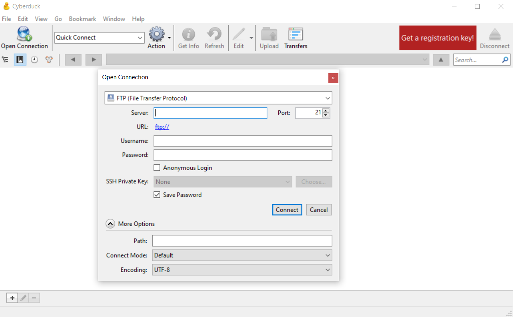
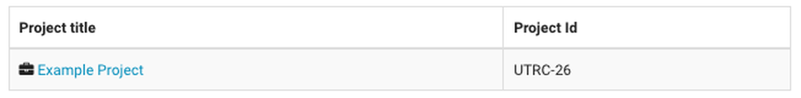
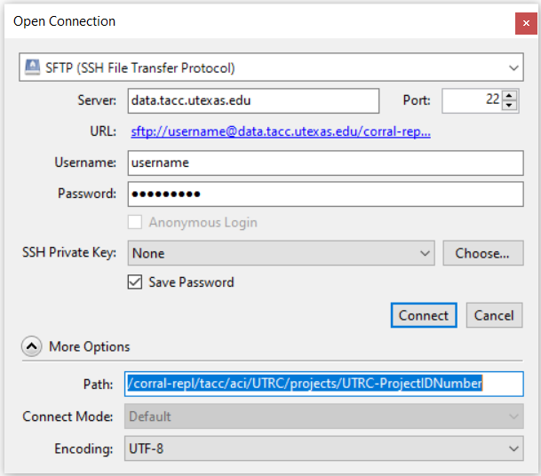
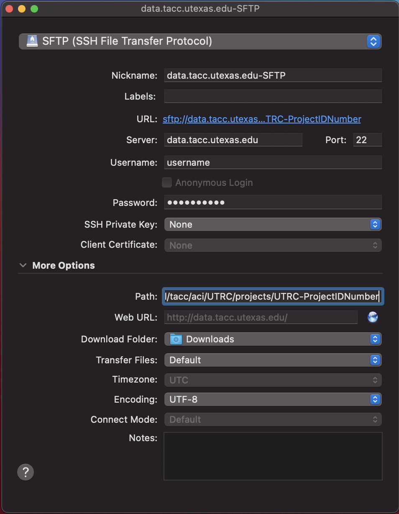

# Accessing Data
To access files stored in the UTRC Portal, you can follow the [Globus Data Transfer Guide](https://utrc.tacc.utexas.edu/globus-guide/).

For educators who are familiar with [Cyberduck](https://cyberduck.io/), or would like to use [Cyberduck](https://cyberduck.io/) to access files stored in the UTRC Portal, follow our guide below. Cyberduck is a free graphical tool for data transfer and an alternative to using the command line. With a drag-and-drop interface, it is easy to transfer a file from the UTRC Portal to your local system. You can use Cyberduck for Windows or macOS.    

## Windows Cyberduck
Download and install [Cyberduck for Windows](https://cyberduck.io/download/) on your local machine.

Click **Open Connection** in the top left corner of your Cyberduck window.

**Figure 1. Windows Cyberduck and "Open Connection" setup screen**

To setup a connection, select **SFTP (SSH File Transfer Protocol)** from the drop-down menu and type in the server name `data.tacc.utexas.edu`. Add your TACC username and password in the spaces provided. If the **More Options** area is not shown, click the small triangle button to expand the window; this will allow you to enter the path to your UTRC project directory (ex. `/corral-repl/tacc/aci/UTRC/projects/UTRC-ProjectIDNumber`) so that when Cyberduck opens the connection you will immediately be in the UTRC project folder on Corral. Click the **Connect** button to open your connection.

To Identify Project ID Numbers:

- You can find the Project ID Number by navigating to the My Projects section of the UTRC Portal. The unique Project ID Number of each project is listed under Project Id in the second column.

**Figure 2. My Projects table**

> Note: The PI of the project folder you wish to connect to via Cyberduck will provide you with the Project ID Number to be used in the path. For example, if your PI has a project called Example Project with a corresponding Project ID Number of 26, the path to Example Project would be `/corral-repl/tacc/aci/UTRC/projects/UTRC-26`.

Consult Figure 3. below to ensure the information you have provided is correct.
If you have not done so already, replace the “Path” with the path to the project folder. Remember to replace ProjectIDNumber with the correct number given to you by the PI of the project folder you wish to connect to.

**Figure 3. Windows "Open Connection" setup screen**

> Note: You will be prompted to “allow unknown fingerprint…” upon connection. Select **allow** and enter your TACC token value.

Once connected, you can navigate through your remote file hierarchy using familiar graphical navigation techniques. You may also drag-and-drop files from your local computer into the Cyberduck window to transfer files to Corral.

## macOS Cyberduck
Download and install [Cyberduck for macOS](https://cyberduck.io/download/) on your local machine.

Once installed, go to **Bookmark > New Bookmark** to setup a connection.

> Note: You cannot select Open Connection in the top left corner of your Cyberduck window as macOS’ setup screen is missing the More Options button.

To setup a connection using **New Bookmark**, select **SFTP (SSH File Transfer Protocol)** from the drop-down menu. Type in the server name `data.tacc.utexas.edu`. Add your TACC username and password in the spaces provided. If the **More Options** area is not shown, click the small triangle or button to expand the window; this will allow you to enter the path to your transfer directory (ex. `/corral-repl/tacc/aci/UTRC/projects/UTRC-ProjectIDNumber`) so that when Cyberduck opens the connection you will immediately be in the UTRC project folder on Corral. As you fill out the information, Cyberduck will be creating the bookmark for you. Exit out of the setup screen and click on your newly created bookmark to launch the connection.

To Identify Project ID Numbers:

- You can find the Project ID Number by navigating to the My Projects section of the UTRC Portal. The unique Project ID Number of each project is listed under Project Id in the second column. Consult Figure 2. above for help navigating the My Projects table.

> Note: The PI of the project folder you wish to connect to via Cyberduck will provide you with the Project ID Number to be used in the path. For example, if your PI has a project called Example Project with a corresponding Project ID Number of 26, the path to Example Project would be `/corral-repl/tacc/aci/UTRC/projects/UTRC-26`.

**Figure 4. macOS “New Bookmark” setup screen**

Consult Figure 4. above to ensure the information you have provided is correct. If you have not done so already, replace the “Path” with the path to your individualized transfer directory.

> Note: You will be prompted to “allow unknown fingerprint…” upon connection. Select allow and enter your TACC token value.

Once connected, you can navigate through your remote file hierarchy using familiar graphical navigation techniques. You may also drag-and-drop files from your local computer into the Cyberduck window to transfer files to Corral.

 

---
Return to the [Overview](index.md)
